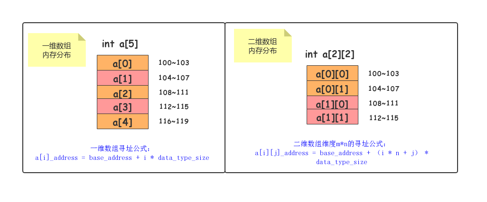
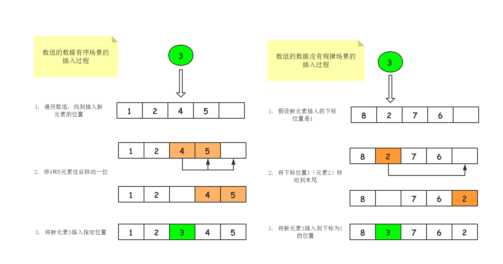
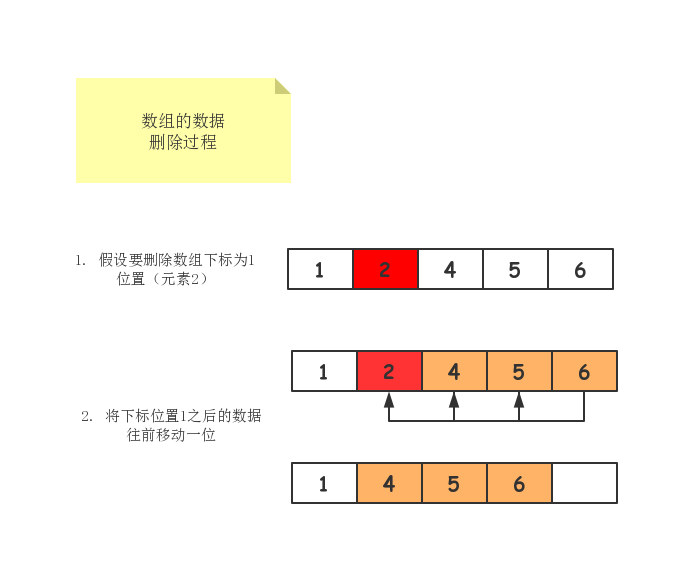

# Array 

## Array Intro

- 线性表
- 连续内存空间
- 相同的类型数据
- 随机访问-通过下标访问

## Array 内存地址

一维地址:


二维数组地址:


## 问题1： 为什么数组下标从零开始

计算机内存地址:

```shell
a[i]_address = base_address + i * data_type_siz
```

如果从1开始，内存地址计算: 多了一个减法运算

```shell
a[i]_address = base_address + (i - 1) * data_type_siz
```

## 问题2: ArrayList为什么要实现RandomAccess接口

```java

```

- 主要原因是为了查询算法或者其他算法的时候，可以让算法选择不同的算法

```java
   public static <T>
    int binarySearch(List<? extends Comparable<? super T>> list, T key) {
        if (list instanceof RandomAccess || list.size()<BINARYSEARCH_THRESHOLD)
            return Collections.indexedBinarySearch(list, key);
        else
            return Collections.iteratorBinarySearch(list, key);
    }
```

## 问题3: 如何插入指定位置元素

- ArrayList
1. grow size +1
2. 把所在位置之后的所有元素都移动一位
3. 指定位置放入值
4. 如果只是无序数组，先把当前位置元素发到最后，然后再
把插入数字放入

5. 如果是LinkedList，找到当前位置
6. 当前位置的前一个元素指针指向此元素
7. 先加入元素的指针指向当前位置的后一个元素


## 问题4: 如何删除元素
1. 删除当前位置元素
2. 移动后面元素到删除位置

   
## 问题5: ArrayCopy

```
Arrays.copyOf()
System.arrayCopy()
```
