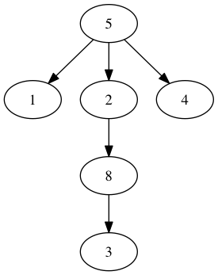
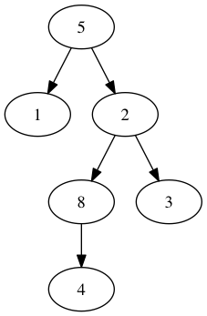
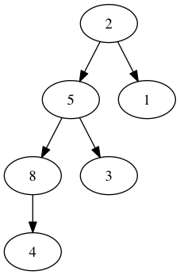

# Binary Tree

Following is a simple tree:

- Root
- Deep-Length

Following is a simple binary Tree:

- Root
- Deep-length

Following is a simple binary search tree:

left is small while right is bigger

