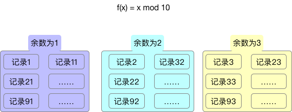

# 取余数的用途

数学中有取余数这么一个简单的方法，但是在计算机用可以利用他解决一些问题,余数本身可以理解为一个hash函数.
我们看一下具体的例子，比如想存储一个比较的记录集合,同时可以方便查找。如果可以存放在一个连续的内存空间肯定是最好，但是实际情况可能没有这么大的连续空间，但是可能有10个小的空间，每一个小的空间内部是连续的。
那么我们就可以将每个记录的id 和10 做一次取余数的操作，余数0-9的数就可以分配到不同的小空间，而查找数据的时候只要判断余数是多少就可以取对应的集合中找数据，这样就既满足了存贮的问题，也满足了能够查找数据的需求.

大体情况如下图:

各个语言中都会使用到hash map这样的数据结构，里面就使用到了类似以上的原理，后面会进行比较详细的介绍和学习.